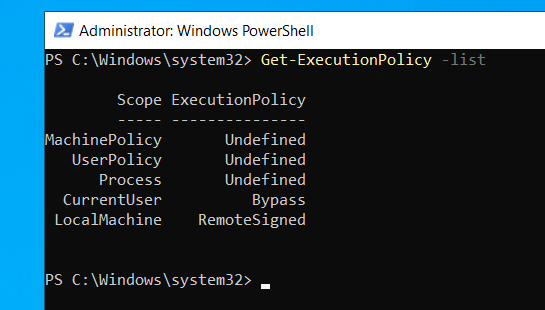

# 1/c Maeve Duffin 
# Computer and Network Security 
# 28 September 2023

## **Section 2: Creating AD Users** 
### Here is a photo of the Member Of and Account tab. It shows that a new user account was created.
### 

## **Section 3: Logon with User Account** ## 
### Here is a photo that shows that the newly created user account works. 
### 

## **Section 4.1: Change Powershell Permissions** ## 
### We changed the execution policy for the current user to be RemoteSigned. This will allow the user to be able to execute commands in Powershell for the Daeve C. Muffin user. 
### 
### 

## **Section 4.2: Test Powershell Script Execution** ##
### 

## **Section 4.3: Create More AD Objects** ##
### 
### 
### 
