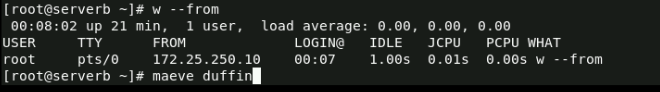
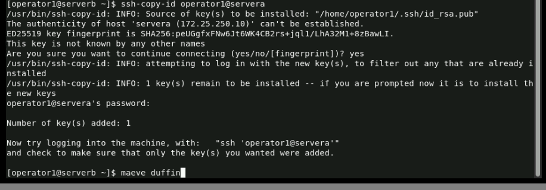
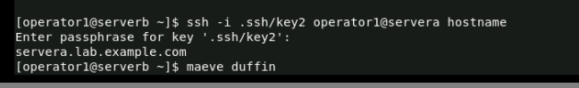
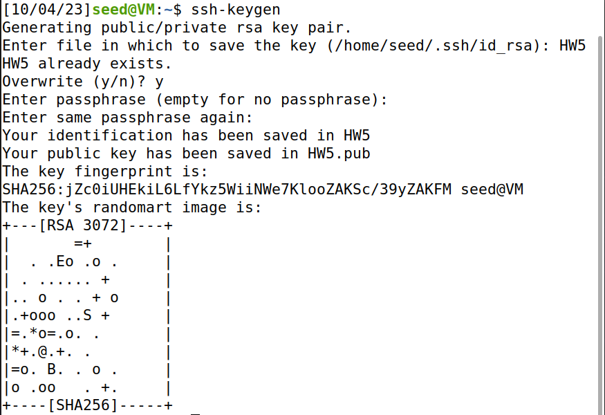
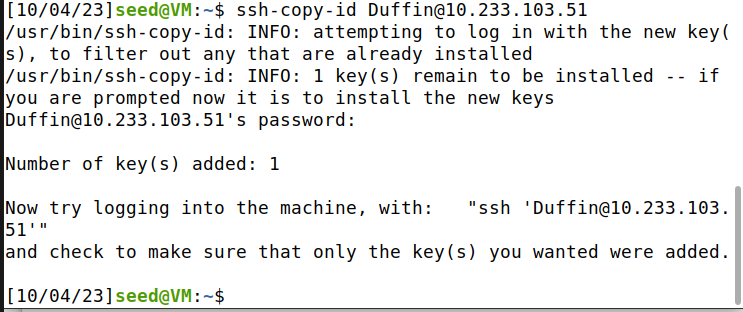
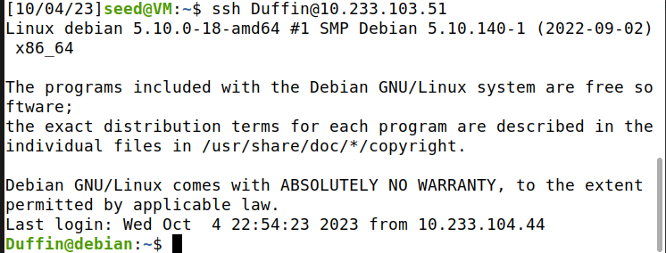

# 1/c Maeve Duffin 
# Computer and Network Security 
# 05 October 2023

## **Section 2: Learning More about SSH ** 
### Here is a photo step #6 in Section 10.2 
### 
### Here is a photo step #12 in Section 10.2 
### 
### Here is a photo step #4 in Section 10.4 
### 
### Here is a photo step #9 in Section 10.4 
### 

## **Section 3: Applying Key Based Authentication**
### Here is a screenshot generating the SSH Keys  
### 
### Here is a screenshot sharing the public key to the Cybernet jump box.  
### 
### Here is a screenshot login using the key based authentication. 
### 
