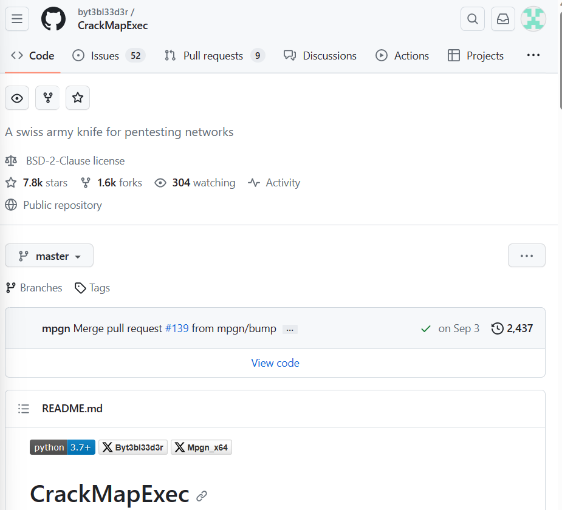
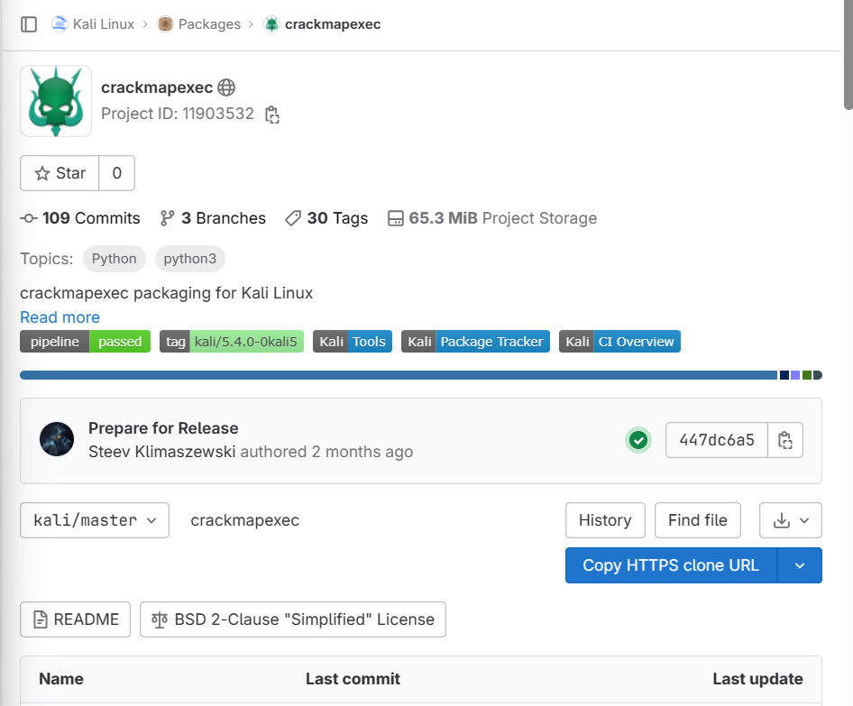
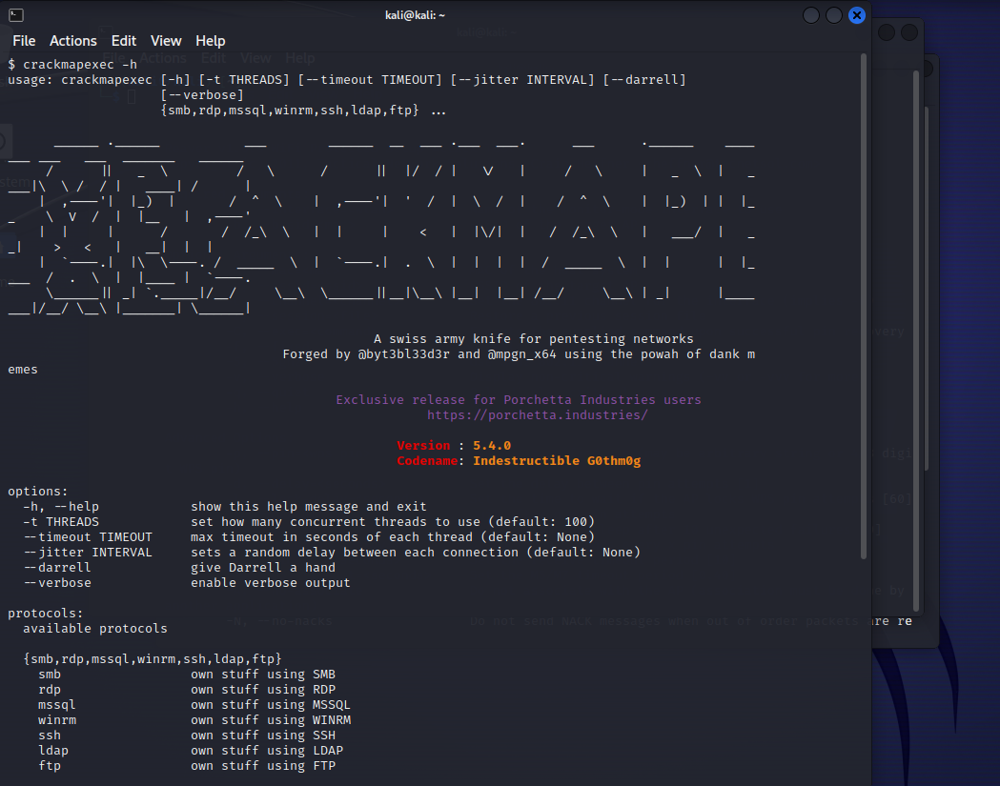
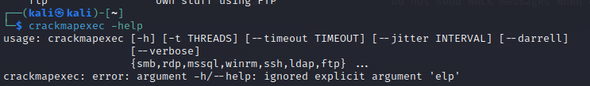

# 1/c Maeve Duffin 
# Computer and Network Security 
# 16 November 2023

## **Section 2: Research a Security Tool ** 
### Crackmapexec (CME) is used for pentesting Windows/ Active Directory environments. CME uses Linux as its operating system and utilizes Python as its programming language. CME is open source and is constantly receiving updates. CME examines the weaknesses in Active Directory security. It helps automate the security of large Active Directory networks and enables credentials to be gathered which allows privilege escalation and lateral movement. A database is used to store used and dumped credentials. Allows user to easily keep track of credentials sets and gain additional situational awareness in large Active Directory environments. It can test networks, facilitating enumeration, attacks, and post-exploitation that can be used on multiple network protocols. 
### The software can be found on GitHub.
### Here is the link to Git Hub: https://github.com/byt3bl33d3r/CrackMapExec 
### Screenshot of Git Hub: 
### 
### The software can also be found on GitLab.
### Here is the link to GitLab: https://gitlab.com/kalilinux/packages/crackmapexec 
### Screenshot of Git Lab: 
### 

## **Section 3: Demonstrate Use of the Chosen Tool** ## 
### Here is a photo of crackmapexec running on the Kali Virtual Machine. 
### 
### 
